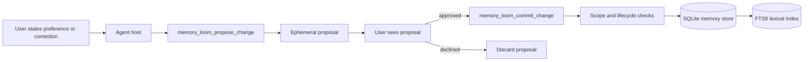
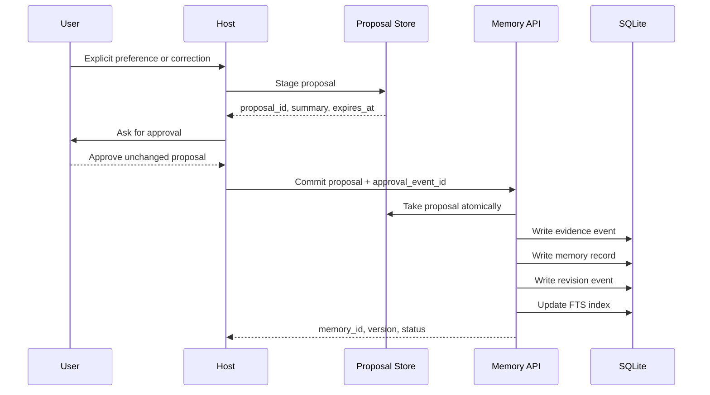
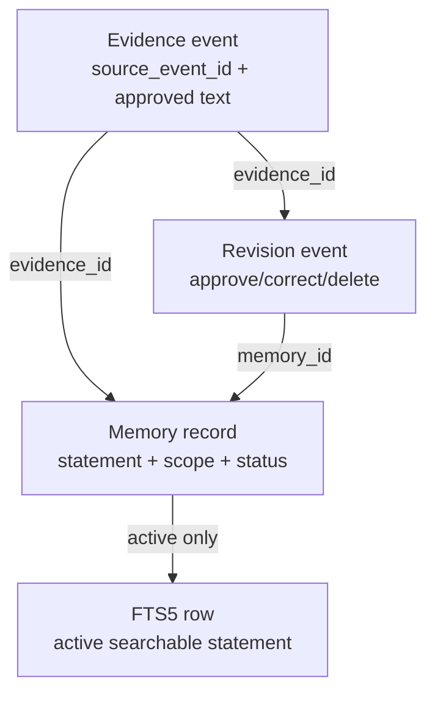

# Import Architecture

## Status

- Classification: design decision
- Implementation status: implemented for explicit preferences and direct corrections
- Boundary: local MCP or JSON stdio into SQLite
- Scientific result: no

This document describes how information enters durable Memory Loom storage. In
this project, "import" means **memory admission**: turning an explicit user
preference or correction into an approved, inspectable memory record.

It does not mean bulk document ingestion, background summarization, or automatic
profile building.

## Architecture

## Commit Sequence

## Storage Shape

## Flow

1. The host sees an explicit preference or correction.
2. The host calls `memory_loom_propose_change` with the proposed statement,
   source event, operation, and scope level.
3. Memory Loom creates an ephemeral proposal. No durable memory is written.
4. The host shows the proposal summary to the user.
5. The user approves the unchanged proposal.
6. The host calls `memory_loom_commit_change` with the proposal ID and approval
   event ID.
7. Memory Loom writes evidence, memory, revision, and index rows in one store
   operation.

## Stored Artifacts

| Artifact | Purpose |
|---|---|
| Evidence event | Records the approved source text and host source event ID |
| Memory record | Stores the active preference or correction used during retrieval |
| Revision event | Records approve, correct, supersede, or delete operations |
| FTS index row | Makes active memory searchable by lexical candidate retrieval |

## Guardrails

- Proposals are temporary and expire.
- `commit` is the only durable write path exposed through MCP.
- The host supplies user/project/task scope outside model-controlled arguments.
- Corrections must target the active version seen when the proposal was created.
- Delete erases user-authored statement and evidence content, then removes index
  entries.
- Declined or discarded proposals create no evidence, memory, revision, or index
  rows.

## Code Map

| Area | Files |
|---|---|
| MCP proposal and commit tools | [`../src/memory_loom/mcp_server.py`](../src/memory_loom/mcp_server.py) |
| Ephemeral proposal storage | [`../src/memory_loom/mcp_proposals.py`](../src/memory_loom/mcp_proposals.py) |
| Lifecycle persistence | [`../src/memory_loom/store.py`](../src/memory_loom/store.py) |
| Tool request/response models | [`../src/memory_loom/mcp_models.py`](../src/memory_loom/mcp_models.py) |
| MCP contract examples | [`../contracts/v1/mcp/`](../contracts/v1/mcp/) |

## Conference Summary

Memory Loom imports memory only through a visible approval checkpoint. The model
can suggest a candidate, but it cannot make that candidate durable or silently
broaden its scope. Every committed memory has provenance, lifecycle state, and a
delete path.
