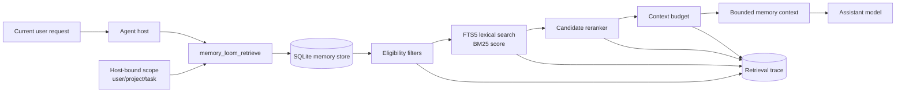
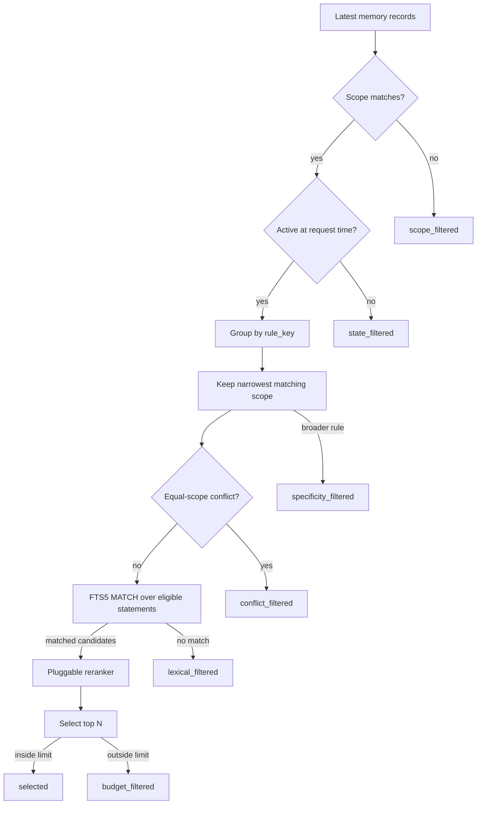
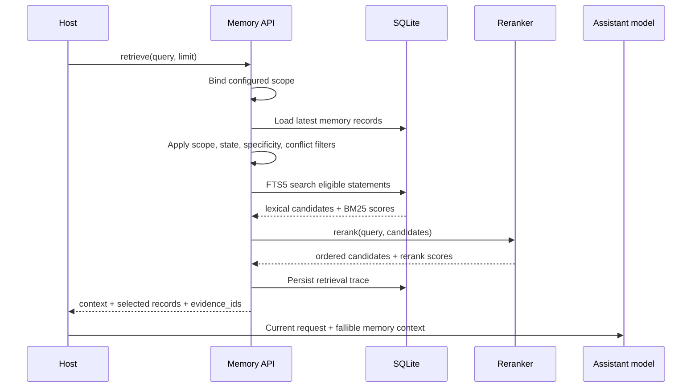
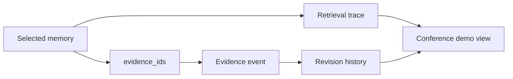
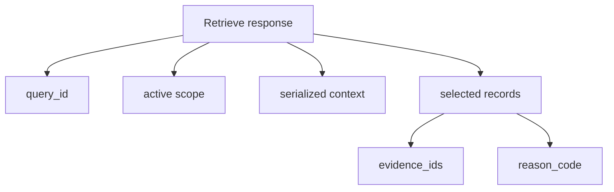

# Retrieval Architecture

## Status

- Classification: design decision
- Implementation status: implemented for scoped lexical retrieval with pluggable reranking
- Boundary: local MCP or JSON stdio from host into SQLite
- Scientific result: no

This document shows how Memory Loom retrieves approved memory for a current
assistant request. The current request remains higher priority than any returned
memory.

## Architecture

## Eligibility And Ranking

## Retrieval Sequence

## Provenance Path

## Output Shape

## Conference Summary

Memory Loom retrieves only records that pass policy filters before ranking. It
then separates candidate search from reranking, records the full decision trace,
and returns selected memories with provenance IDs so the host can explain why a
memory appeared.
